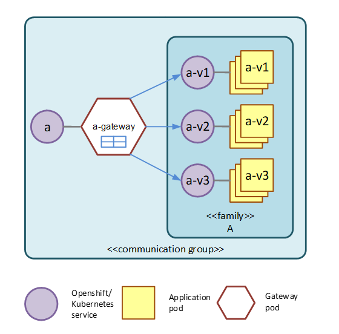

[](https://github.com/Netcracker/qubership-core-facade-operator/actions/workflows/go-build.yml)
[](https://sonarcloud.io/summary/overall?id=Netcracker_qubership-core-facade-operator)
[](https://sonarcloud.io/summary/overall?id=Netcracker_qubership-core-facade-operator)
[](https://sonarcloud.io/summary/overall?id=Netcracker_qubership-core-facade-operator)
[](https://sonarcloud.io/summary/overall?id=Netcracker_qubership-core-facade-operator)
[](https://sonarcloud.io/summary/overall?id=Netcracker_qubership-core-facade-operator)

Facade Operator documentation consists of the following:

* [Overview](#overview)
* [Requirement](#requirement)
* [Important](#important)
* [Description of Facade Operator CR fields ](#description-of-facade-operator-cr-fields)
* [Control Plane API to register a route](#control-plane-api-to-register-a-route)
* [Master custom resource configuration](#master-custom-resource-configuration)
* [Troubleshooting](#troubleshooting)
    * [Facade-gateway is not created](#facade-gateway-is-not-created)
    * [Facade-gateway gets OOMKilled](#facade-gateway-gets-oomkilled)
    * [Removing application with facade-gateways](#removing-application-with-facade-gateways)

# Overview
Facade Operator is in charge to create facade gateway and Service for it.
Facade gateway serves multiple microservices/families (a group of different versions of the same microservice).



An API to Facade Operator is Kubernetes/Openshift custom resource (CR) that corresponds to custom resource definition (CRD) 
delivered together with Facade Operator. 

In order to deploy a facade gateway, you must create a CR.
For example:

```
apiVersion: "netcracker.com/v1alpha"
kind: FacadeService
metadata:
  name: test-service #family-name
spec:
  port: 8080
```

Facade gateway name corresponds to the following naming convention.

(Openshift/Kubernetes) Service name is specified trough the API above, in `name` tag. 
If facade serves a family (facade replaces non-blue-green version of a microservice) to have name = `<family-name>`, then
facade gateway microservice (deployment config) name is automatically created as `<family-name>-gateway`.

# Requirement
A requirement to deploy Facade Operator is described in [Facade Operator Prerequisites](/docs/prerequisites.md).

# Important
Currently, Facade Operator supports two CRD creation modes:  
* manual creation by cloud-admin
* in the **predeploy script** of the Facade Operator

The predeploy script for creating CRD supports the following PaaS:
* Openshift 3.11 or higher
* Kubernetes 1.15 or higher

# Description of Facade Operator CR fields
Example facade operator CR
```yaml
{
    "apiVersion": "netcracker.com/v1alpha",
    "kind": "FacadeService",
    "metadata":
    {
        "name": "trace-service-3",
        "namespace": "core-rnd-cpl-3"
    },
    "spec":
    {
        "env":
        {
            "facadeGatewayCpuLimit": "101m",
            "facadeGatewayCpuRequest": "101m",
            "facadeGatewayMemoryLimit": "105Mi",
            "facadeGatewayMemoryRequest": "105Mi",
            "facadeGatewayConcurrency": null
        },
        "replicas": 1,
        "gateway": "trace-services-gateway",
        "gatewayType": "mesh",
        "port": 8080,
        "gatewayPorts":
        [
            {
                "name": "web",
                "protocol": "tcp",
                "port": 8080
            },
            {
                "name": "web2",
                "protocol": "tcp",
                "port": 1234
            }
        ],
        "masterConfiguration": true
    }
}
```
* Name - CR name. Based on the CR name, either a facade gateway with the {CR name}-gateway or a virtual service in the case of a composite gateway will be created
* Replicas - Number of replicas with which a facade or composite gateway will be created. By default, for all facade or composite gateways, the number of replicas is set in the env variable FACADE_GATEWAY_REPLICAS
* Env - This field specifies the limits of a facade or composite gateway
* Port - This is the port that will be specified in the service
* GatewayPorts - In case you need a non-standard port or the service needs to serve more than 1 port, then they all should be listed in this field. This field takes precedence over the 'port' field
* MasterConfiguration - The field indicates whether this CR will be considered the main [Master custom resource configuration](#master-custom-resource-configuration)
* FacadeGatewayConcurrency - limit number of workers inside envoy which process requests
* gatewayType - optional type of gateway. Possible values: `ingress`, `mesh`, `egress`. Default is `mesh`. There are limitations for custom `ingress` gateways, see [ingress-gateways](https://github.com/Netcracker/qubership-core-control-plane/blob/main/docs/mesh/ingress-gateways.md) // TODO OS. 

# Control Plane API to register a route
Control Plane manages routing tables that are executed by gateways. 
The role of a routing table is to define microservice that will serve particular request by the request path and version.
For creating routes use [Control Plane API](https://github.com/Netcracker/qubership-core-control-plane/blob/main/docs/api/control-plane-api.md) to register routes

# Master custom resource configuration
In order to set the composite gateway HW resources, you can use the masterConfiguration field on one of the CR.
This CR will be considered the master and the resources for the composite gateway will be specified according to this CR. 

# Troubleshooting
## Facade-gateway is not created
If during your project deploy some facade-gateways or services are not created by facade-operator by any reason, restart facade-operator Pod.
It should recreate the missing entities.

If your project contains a big amount of services and facade-operator gets killed you need to adjust the resources limits.
for overriding CPU_REQUEST, CPU_LIMIT, MEMORY_LIMIT parameters.

Be aware the parameters FACADE_OPERATOR_CPU_REQUEST, FACADE_OPERATOR_CPU_LIMIT, FACADE_OPERATOR_MEMORY_LIMIT 
are deprecated.

## Facade-gateway gets OOMKilled
If your facade-gateway gets OOMKilled, please increase memory limit for it. Set variable FACADE_GATEWAY_MEMORY_LIMIT, but it will be applied to ALL facade-gateways created by facade-operator. Default value is "32Mi" ("64Mi" for egress-gateway)

## Removing application with facade-gateways
If you want to remove application which uses facade-gateway, you need to delete CR facadeservice for all microservices in your application.  
P.S. If you delete only deployments of facade-gateways you will need to reboot pod facade-operator after redeploy your application to create facade-gateways for it again.

## Performance
Below are the data on the time of creation of 50 gateways:

Composite gateway:
* Hook mode with disable TLS - 16s
* Hook mode with enable TLS - 1m 30s
* Sync mode with disable TLS - 30s
* Sync mode with enable TLS - 3m 30s

Facade gateway:
* Hook mode with disable TLS - 25s
* Hook mode with enable TLS - 2m
* Sync mode with disable TLS - 4s
* Sync mode with enable TLS - 50s
